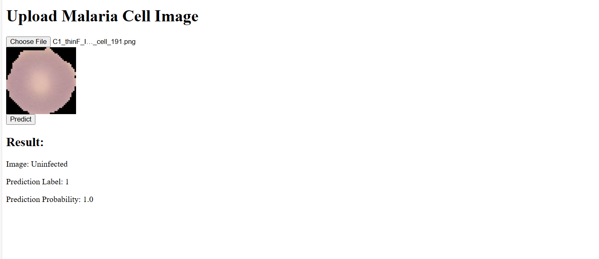
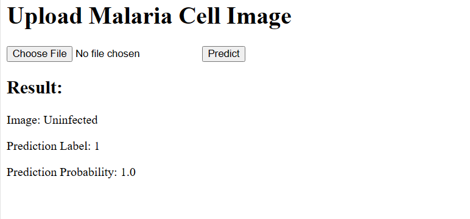

# Malaria_prediction
Prediction of Malaria with help of Pretained Models


# What the Project is about ?
The Project is mainly prepared and executed to learn
1. How to write modular coding for end to end MLOPS
2. How the MLOPS is executed using dvc.yaml
3. How to use MLFLOW to track experiments and runs ( I have provided the link for this project exp)
4. A web app is developed using html,css and flask for in detail analysis and prediction of wine quality


# How to use the rep
1. Clone the repository
```bash
https://github.com/vikramviky123/malaria_prediction
```
2. Create environment using
```bash
conda create -p myenv python==3.10.9 -y
```
3. Install all dependancies from requirements.tx
```bash
pip install -r requirements.txt
```
4. runpython file( attached same output at the bottom)
```bash
python main.py
```

# How the Project flows
The project has

1. src folder:This folder is the heart of the project where modular coding just flows from file to file
2. I has subfolders constants, entity, configuration manager, components, pipeline, utils each serve there purpose.

The flow is as follows
* config file: (its yaml file holds data of folder paths)
* entity: (its a class to create instances for paths)
* configuration manager: (its a class, stores paths from config.yaml to entity instances)
* components: (it has several files starting from creation of config instances, using the instances to create directories and ingest data, develop model trainer, develop evaluation file, develop predict file(for url use))
* pipeline: (it runs all required files of in components as line by line with one file)
* utils: (it has misc code, example to create yaml file, save pickle file, load files etc anything which is common to use in all the folders)

The flow is summarized to give the effect as below

* DATA INGESTION
* DATA TRANSFORMATION
* BASE MODEL PREPARATION
* MODEL TRAINING
* MODEL EVALUATION
* PREDICT

The pipeline runs the above one by one with just one file, the use of dvc is it tracks all the runs.
lets say you change parameters the change is only in training so, the dvc runs only from MODEL TRAINING....which saves lot of time and resources


# run python app.py 

Running python app.py will launch web app in local host
1. It has detailed overview of project.
2. Plots of univariate, pairplots, correlation plots are also integrated
3. model analysis is also presented
4. model plots are also presented

I am attaching snapshot of each page

## Upoload data


## Prediction Summary


